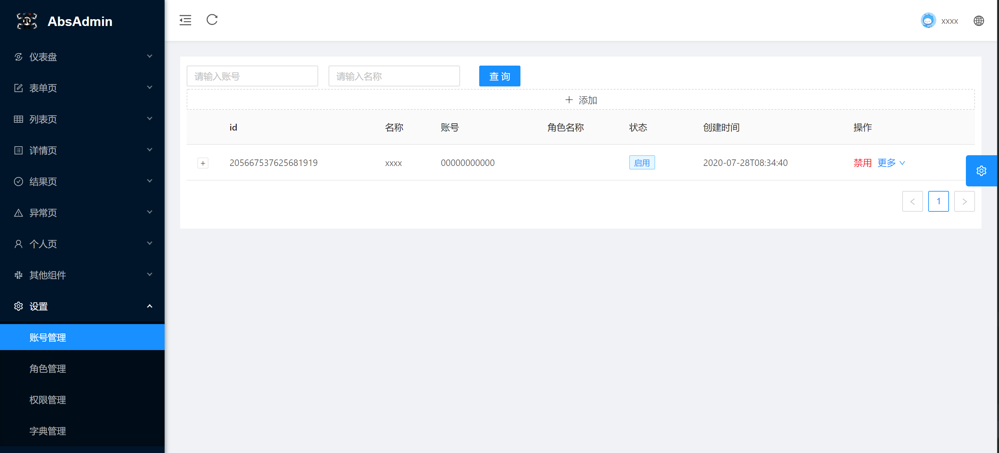

[简体中文](README_CH.md)



- Rock solid (Rust language), high performance, no GC, no memory leaks, no coroutine contention

DDD domain driver,Mysql,Redis, general middleware and database, general enterprise-level framework selection

- [rbatis - orm] (https://github.com/rbatis/rbatis) and the same use Mybatis - Plus, concise, easy to extend the orm framework

- [fast_log] (https://github.com/rbatis/fast_log) super quick asynchronous logging framework, support for zip, cutting

- [actix-web](https://actix.rs/) Perennial butcher list Web frame pressure test site frame

The separation - both before and after the end, based on [Vue - JS] + [Vue - AntDesign] (https://cn.vuejs.org/) (https://www.antdv.com/docs/vue/introduce-cn/) + [Vue-AntDesign-Pro](https://pro.antdv.com/)

- RBAC permission control, including JwtToken authentication login, graphic verification code login, TWO-DIMENSIONAL code scan login, and basic permission management


# Progress, functional modules (including (including web front-end and RUST backend))


| function (including the web front end and rust back-end) | support |
| -------------------------------------------------------- | ------------------ |
| dynamic menu (routing table permissions dynamically generated menu) | √ |
| JWT interceptor check | √ |
| JWT account password | √ |
| set permissions/management (father and son, permissions + menu button permissions, cache redis) | √ |
| Settings/role management (father and son, hierarchical level authority tree, cache redis) | √ |
| Settings/account management background (hierarchical role tree) | √ |
| Settings/keys to constant management | √ |
| JWT graphical verification code + password |  x |
| JWT text login (based on redis SMS message) |  x |


# The significance of this project


- high performance, as fast as C++, ultra low memory footprint, support for low-cost servers

- Stable, smooth deployment, no memory leakage, and no flash rollback

- Out of the box


# (Rust server installation) Quick installation tutorial


1. Use the docker command to quickly start redis and mysql(user name root password 123456). Production Docker can recommend deploying HTTP service. In principle, production environment does not recommend deploying database with Docker


```cmd

docker run -it -d --name redis -p 6379:6379 redis

docker run -d -p 3306:3306 -e MYSQL_ROOT_PASSWORD=123456 --name mysql -e TZ=Asia/Shanghai mysql:5.7

```


- 2. (Rust server installation) Use the Clion Database window or MysqlWorkBench or Navicat tools to import the database. SQL script into the Mysql Database (Mysql username and password root) 123456) (Redis has no password)


# (Front-end Node service installation) Quick installation tutorial


- 1 (front) read and front-end cloning project at https://github.com/rbatis/abs_admin_vue


- 2. (front-end installation) Use 'NPM install' to install dependencies (or taobao image CNPM) and run the 'yarn serve' command to start the web front-end


- 3. (Front-end installation) Open the browser http://localhost:8001 to log in to the background


# (Postman import) tutorial


- 1. (Postman installation) Install postman. Import postman.json to Postman to use the written request


```cmd

Open postman and import postman.json

```


- 2. (Postman installation) Import the ABS_admin project using the Clion clone, click main.rs and click the button to run. Or execute a command:


```cmd

cargo update

cargo run

```


# module(module)


- JWT token Auth(Permission authentication based on JWT token)

- Role,User,Reource (Role,User, permission)
