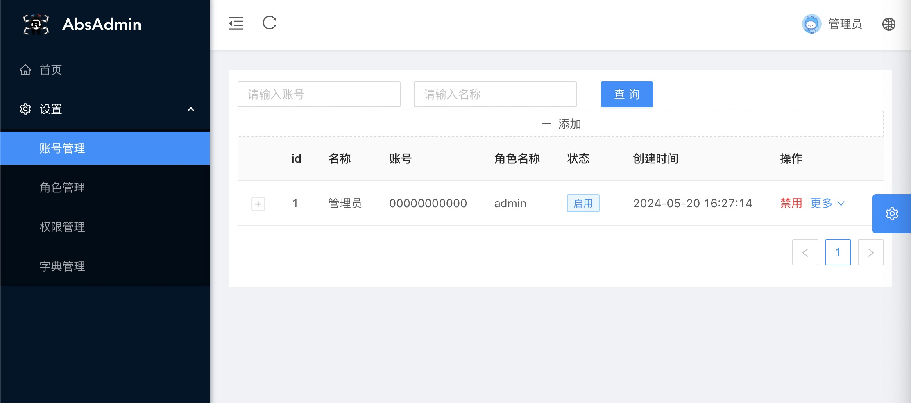

[Chinese](README_CH.md)

- Rock solid (Rust language), high performance, no GC, no memory leaks, no coroutine contention

DDD domain driver,Mysql,Redis, general middleware and database, general enterprise-level framework selection

- [rbatis - orm] (https://github.com/rbatis/rbatis) and the same use Mybatis - Plus, concise, easy to extend the orm framework

- [fast_log] (https://github.com/rbatis/fast_log) super quick asynchronous logging framework, support for zip, cutting

- [axum](https://github.com/tokio-rs/axum) tokio Web library

The separation - both before and after the end, based on [Vue - JS] + [Vue - AntDesign] (https://cn.vuejs.org/) (https://www.antdv.com/docs/vue/introduce-cn/) + [Vue-AntDesign-Pro](https://pro.antdv.com/)

- RBAC(5-tables) permission control, including JwtToken authentication login, graphic verification code login, TWO-DIMENSIONAL code scan login, and basic permission management


# Progress, functional modules (including (including web front-end and RUST backend))


| function (including the web front end and rust back-end) | support |
| -------------------------------------------------------- | ------------------ |
| dynamic menu (routing table permissions dynamically generated menu) | √ |
| JWT interceptor check | √ |
| JWT account password | √ |
| set permissions/management (father and son, permissions + menu button permissions, cache redis) | √ |
| Settings/role management (father and son, hierarchical level authority tree, cache redis) | √ |
| Settings/account management background (hierarchical role tree) | √ |
| Settings/keys to constant management | √ |
| JWT graphical verification code + password |  x |
| JWT text login (based on redis SMS message) |  x |


# The significance of this project


- high performance, as fast as C++, ultra low memory footprint, support for low-cost servers

- Stable, smooth deployment, no memory leakage, and no flash rollback

- Out of the box


# (Rust Server-Side Installation) Quick Installation Tutorial

* 1 Start abs_admin command by using `cargo run` or `cargo build` to compile the executable file and execute it.
* (Optional) Use the docker command to quickly start redis: `docker run -it -d --name redis -p 6379:6379 redis`
* (Optional, default database is SQLite, if using MySQL, add rdbc_mysql dependency to Cargo.toml and modify db_url in application.json5) Use the docker command to quickly start MySQL. For production, it is recommended to deploy the HTTP service and not use docker to deploy the database. `docker run -d -p 3306:3306 -e MYSQL_ROOT_PASSWORD=123456 --name mysql -e TZ=Asia/Shanghai mysql:5.7`
* cmd or terminal run command  `cargo run`

# (Front-end Node service installation) Quick installation tutorial


- 1 (front) read and front-end cloning project at https://github.com/rbatis/abs_admin_vue , and install nodejs


- 2. (front-end installation) Use `yarn install` to install dependencies  and run the `yarn serve` command to start the web front-end


- 3. (Front-end installation) Open the browser http://localhost:8001 to log in to the background


# (Postman import) tutorial


- 1. (Postman installation) Install postman. Import postman.json to Postman to use the written request


```cmd

Open postman and import postman.json

```


- 2. (Postman installation) Import the ABS_admin project using the Clion clone, click main.rs and click the button to run. Or execute a command:


```cmd

cargo update

cargo run

```


# module(module)


- JWT token Auth(Permission authentication based on JWT token)

- Role,User,Reource (Role,User, permission)
