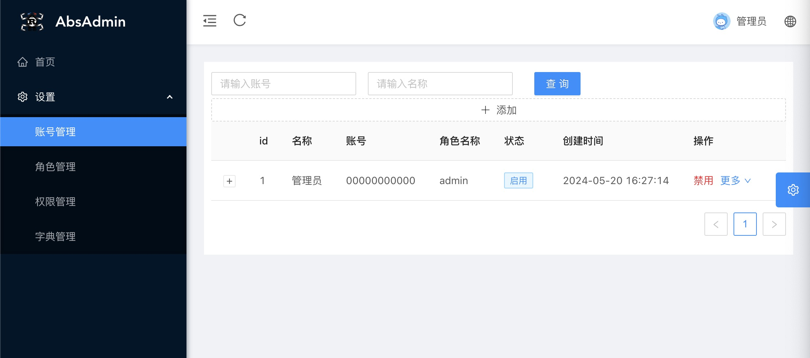

# abs_admin

Enterprise-level Admin Backend Solution built with [Rust](https://www.rust-lang.org/)

[中文文档](#中文文档)

## Features

- Rock solid (Rust), high performance, no GC, no memory leaks
- DDD (Domain Driven Design) architecture
- Frontend-backend separation
- RBAC (5-tables) permission control
- JWT authentication
- Auto table sync: Automatically create/sync tables from struct definitions
- Default data init: Auto-create admin user, role, and permissions
- Multi-database: SQLite / MySQL / PostgreSQL / SQL Server support
- Flexible storage: Local / MinIO / AWS S3 storage switching
- Captcha: Image captcha generation and validation
- Dictionary management: Dynamic system dictionary configuration
- File management: Complete upload/download/delete workflow
- Logging system: Configurable compression, rotation, retention policies
- SMS verification: SMS code login (3rd-party integration ready)
- Cache: In-memory and Redis cache support

## Progress

| Feature | Status | Description |
| --- | --- | --- |
| Dynamic menu | √ | RBAC-based dynamic menu routing |
| JWT auth | √ | Token generation, validation, auto-refresh |
| Permission management | √ | RBAC permission CRUD with hierarchy |
| Role management | √ | Role CRUD and permission assignment |
| Account management | √ | User CRUD, login, status management |
| Dictionary management | √ | Dynamic system dictionary configuration |
| Captcha | √ | Image captcha generation and validation |
| SMS verification | √ | SMS code login (3rd-party integration needed) |
| File upload/download | √ | File upload, download, delete |
| Storage (Local/OSS) | √ | Local / AWS S3 / Alibaba Cloud OSS |
| Cache (Memory/Redis) | √ | In-memory / Redis cache |

## Quick Start

```bash
git clone https://github.com/rbatis/abs_admin.git
cd abs_admin
cargo run
```

Open: http://localhost:8000

Frontend source: https://github.com/rbatis/abs_admin_vue

## Configuration

Edit `application.json5` for database connection and other settings.

Default account: `admin` / `123456`

## Test API

Import `postman.json` to Postman for API testing.

## License

Apache-2.0

---

# 中文文档

[Rust](https://www.rust-lang.org/) 企业级一站式后台管理系统

## 特性

- 坚如磐石（Rust 语言），高性能，无 GC，无内存泄漏
- DDD 领域驱动设计
- 前后端分离
- RBAC (5表) 权限控制
- JWT 认证
- 自动建表：启动时根据结构体自动创建/同步数据库表结构
- 默认数据初始化：自动创建 admin 用户、admin 角色、基础权限
- 多数据库支持：SQLite / MySQL / PostgreSQL / SQL Server
- 灵活存储：本地 / MinIO / AWS S3 存储切换
- 验证码：图片验证码生成与校验
- 字典管理：系统字典动态配置管理
- 文件管理：完整的上传/下载/删除流程
- 日志系统：可配置压缩、轮转、保留策略
- 短信验证：短信验证码登录（需对接第三方服务）
- 缓存支持：内存缓存 / Redis 缓存

## 功能进度

| 功能 | 状态 | 说明 |
| --- | --- | --- |
| 动态菜单 | √ | 基于 RBAC 权限的动态菜单路由 |
| JWT 认证 | √ | 支持 token 生成、校验、自动续期 |
| 权限管理 | √ | RBAC 权限管理（增删改查、层级） |
| 角色管理 | √ | 角色管理、角色权限分配 |
| 账号管理 | √ | 用户 CRUD、登录、状态管理 |
| 字典管理 | √ | 系统字典动态配置管理 |
| 图片验证码 | √ | 图片验证码生成与校验 |
| 短信验证 | √ | 短信验证码登录（需对接第三方服务） |
| 文件上传/下载 | √ | 文件上传、下载、删除 |
| 存储服务（本地/OSS） | √ | 本地存储 / AWS S3 / 阿里云 OSS |
| 缓存服务（内存/Redis） | √ | 内存缓存 / Redis 缓存 |

## 快速开始

```bash
git clone https://github.com/rbatis/abs_admin.git
cd abs_admin
cargo run
```

访问: http://localhost:8000

前端源码: https://github.com/rbatis/abs_admin_vue

## 配置

编辑 `application.json5` 配置数据库连接等参数。

默认账号: `admin` / `123456`

## 测试 API

导入 `postman.json` 到 Postman 进行接口测试。

## License

Apache-2.0
